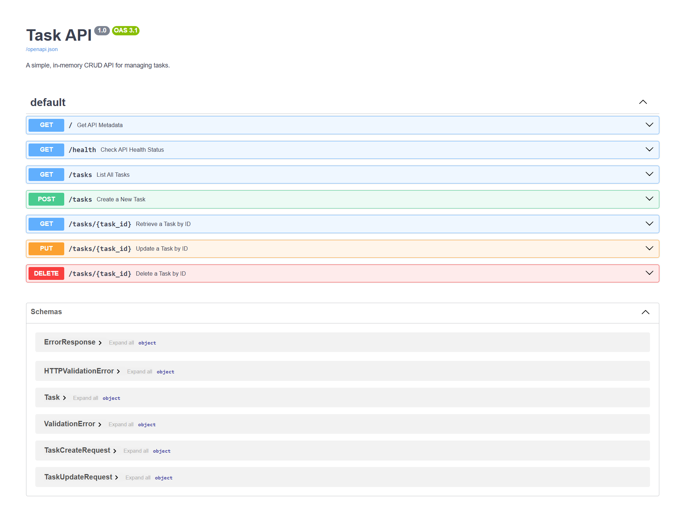

# Task API

A simple, lightweight task management REST API built with FastAPI. This project is the FlyRank Backend Track Week 2 assignment "Build your first CRUD API", utilizing in-memory storage.

## Features

- Root endpoint with API metadata.
- Health check status endpoint.
- Complete CRUD actions for tasks:
  - Create tasks with auto-incremented IDs.
  - List all tasks.
  - Retrieve tasks by ID (returns 404 with custom JSON formatting if missing).
  - Update task title, completion state, or both.
  - Delete tasks (returns 204 No Content).
- Optional features:
  - Query parameter filtering by completion state (`done=true`/`done=false`).
  - Query parameter search term (`search=`) on titles (case-insensitive partial matching).
  - Statistics endpoint (`GET /stats`) returning total, done, and open tasks counts.
  - Reset endpoint (`POST /reset`) restoring the task database to original seed state.
- Interactive Swagger UI documentation page.

## Tech Stack

- Python 3.10+
- FastAPI
- Uvicorn
- Pydantic v2

## Project Structure

```
├── .gitignore
├── .gitattributes
├── docs/
│   └── swagger-ui.png
├── main.py
└── requirements.txt
```

## Installation

```bash
git clone https://github.com/gtathelegend/FlyRank-AI-BE-01.git
cd FlyRank-AI-BE-01
```

Create virtual environment:

```bash
python -m venv venv
```

Activate it:

- Windows PowerShell:
  ```powershell
  .\venv\Scripts\Activate.ps1
  ```
- macOS/Linux:
  ```bash
  source venv/bin/activate
  ```

Then install the dependencies:

```bash
pip install -r requirements.txt
```

## Running the API

Run the application locally using the following command:

```bash
python main.py
```

The API will start running locally at:
[http://localhost:8000](http://localhost:8000)

## Swagger UI

Interactive API documentation is generated automatically by FastAPI and is accessible at:
[http://localhost:8000/docs](http://localhost:8000/docs)

You can view the Swagger UI layout screenshot here:


## API Endpoints

| Method | Endpoint | Description | Success Status |
|---|---|---|---|
| `GET` | `/` | Retrieve API name, version, and endpoints metadata | `200 OK` |
| `GET` | `/health` | Check the health status of the application | `200 OK` |
| `GET` | `/tasks` | List all tasks (supports query filters `done` and `search`) | `200 OK` |
| `GET` | `/tasks/{task_id}` | Retrieve details of a task by its ID | `200 OK` |
| `POST` | `/tasks` | Create a new task | `201 Created` |
| `PUT` | `/tasks/{task_id}` | Update fields of a specific task (title, done status, or both) | `200 OK` |
| `DELETE` | `/tasks/{task_id}` | Delete a task by ID | `204 No Content` |
| `GET` | `/stats` | Retrieve calculated task counts (total, done, open) | `200 OK` |
| `POST` | `/reset` | Restore tasks to the original 3 seed tasks | `200 OK` |

## Status Codes

The API returns the following HTTP status codes:
- `200 OK` - Success status for typical read, update, stats, reset, metadata and health requests.
- `201 Created` - Success status for a new task creation.
- `204 No Content` - Success status for deleting an existing task (returns an empty response body).
- `400 Bad Request` - Validation error when the payload or properties are invalid.
- `404 Not Found` - Error returned when a requested task ID is not found.

## Example curl Output

Below is an example of a real `curl -i` request and response for retrieving task 1:

```bash
$ curl -i http://127.0.0.1:8000/tasks/1
```

Response:
```http
HTTP/1.1 200 OK
date: Mon, 27 Jul 2026 15:51:44 GMT
server: uvicorn
content-length: 45
content-type: application/json

{"id":1,"title":"Complete backend assignment","done":false}
```

## In-Memory Storage / Mortality Experiment

All task data is stored in the local server process memory. Any modifications, additions, or deletions will disappear when the server process is restarted. Upon restart, the initial 3 seed tasks will be loaded. To preserve data across restarts, a persistent storage system such as a SQL/NoSQL database or files would be required.

## Validation

The API validates client input for `POST /tasks` and `PUT /tasks/{task_id}` requests:
- Missing, empty, or whitespace-only task titles are rejected with `HTTP 400`.
- Titles must be strings.
- Non-boolean values for the `done` status parameter are rejected with `HTTP 400`.
- Empty update payloads (`{}`) or updates with no valid properties are rejected with `HTTP 400`.
- All validation failures return a JSON response containing an error explanation (e.g. `{"error": "Title must be a string"}`).

## AI vs me

This project was built with the assistance of a pairing coding partner (Antigravity). For the rematch experiment (Stage 7), we implemented an isolated alternative in `ai-version/main.py` using a strictly declarative, Pydantic-driven validation style and compared it with the main manual-parsing implementation.

### AI Rematch Prompt
"Using Python + FastAPI, independently implement the same core API: GET /, GET /health, GET /tasks, GET /tasks/{id}, POST /tasks, PUT /tasks/{id}, DELETE /tasks/{id}. Use: in-memory list, no database, Swagger at /docs. Required status codes: GET success = 200, POST success = 201, PUT success = 200, DELETE success = 204, invalid request = 400, unknown ID = 404. Validation: POST: title required, non-empty string, done defaults to false. PUT: title and/or done, empty/invalid body = 400. DELETE: 204, empty response body. 404/400 errors should use JSON error messages."

### Comparison

#### 1. What the AI implementation did better
- **Swagger Documentation**: The AI version declares request bodies directly via FastAPI router function signatures using Pydantic models (`TaskCreate`, `TaskUpdate`). This generates correct request schema schemas out-of-the-box in Swagger without any manual OpenAPI schema overrides.
- **Declarative Code**: The structure of the endpoints is much more declarative and typical of standard FastAPI codebases, keeping routes smaller.

#### 2. What it did worse or differently
- **Validation Overhead**: Because FastAPI/Pydantic automatically raises `RequestValidationError` which defaults to returning `422 Unprocessable Entity`, the AI version had to declare a global `@app.exception_handler(RequestValidationError)` and explicitly parse the nested validation payload structure to translate type/missing errors into the required `400 Bad Request` format.
- **Type Coercion Issues**: Standard Pydantic schemas automatically coerce values (e.g. string `"yes"` or `"true"` to `True` for boolean fields). To strictly match the assignment specifications, the AI version had to import and utilize `StrictStr` and `StrictBool` to block coercion.

#### 3. Concrete Differences
- **Request Body Parsing**:
  - *Main Implementation*: Uses raw `Request` objects and parses asynchronously via `await request.json()`, validating manually.
  - *AI Implementation*: Declares `task_input: TaskCreate` / `TaskUpdate` schema parameters directly in the function arguments, letting FastAPI/Pydantic handle parsing.
- **Error Validation Pipeline**:
  - *Main Implementation*: Validates fields imperatively inside each endpoint using `isinstance()` checks and `.strip()`, returning HTTP 400 immediately.
  - *AI Implementation*: Relies on Pydantic's type validations and uses a global FastAPI validation exception handler to catch type constraints and format `400 Bad Request` payloads.
- **Swagger Schema Configuration**:
  - *Main Implementation*: Explicitly overrides `app.openapi_schema` manually via a helper function `custom_openapi()` to document request structures without triggering 422 validations.
  - *AI Implementation*: Needs no manual overrides since the schema is natively generated from the Pydantic type definitions.

### Ambiguities in Specification
- **Response Format for Reset**: The specification did not mandate a specific success payload style (e.g. whether it returns JSON `{"message": "..."}` or `{"status": "..."}` or is empty).
- **PUT Body Requirements**: The spec was ambiguous on whether fields other than `title` and `done` should be ignored or raise a bad request error.
- **Error Formatting**: The exact string content of validation errors was left open, only requiring the `{"error": "..."}` structure.

### Rematch Prompt Improvements
To improve the rematch prompt:
- Mandate exact error message strings to align error responses precisely.
- Specify whether type coercion (e.g. parsing integer `123` to string `"123"`) is allowed.
- Define the expected success payload structures for non-CRUD utility routes like `POST /reset`.
